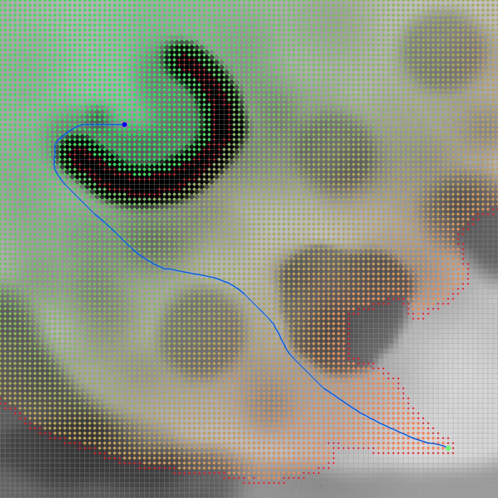
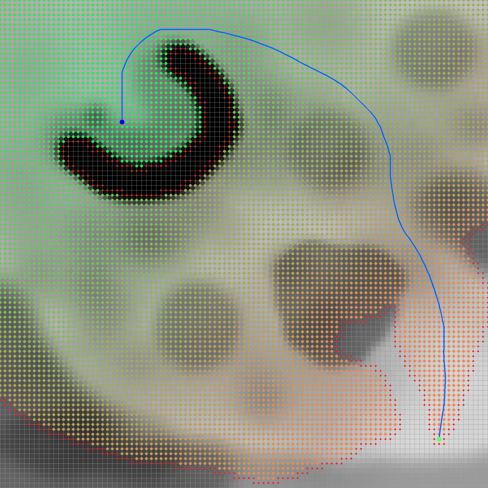
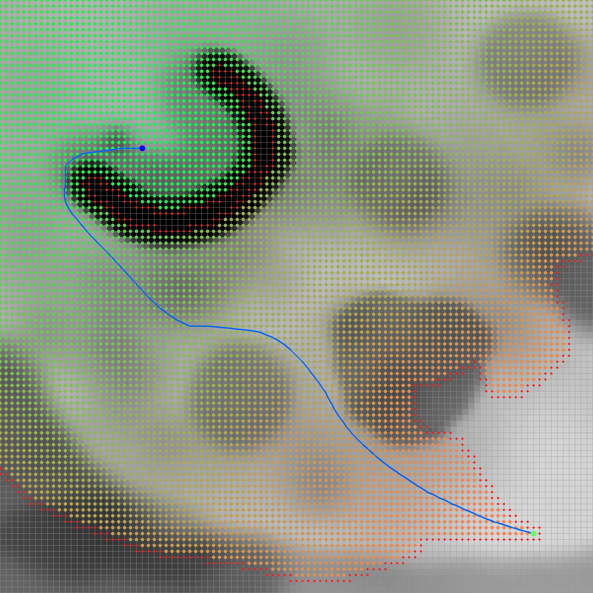

| Cells | Width | Height | Average cost | Minimum cost | Maximum cost |
| ----- | ----- | ------ | ------------ | ------------ | ------------ |
| 10000 | 100   | 100    | 113.221      | 38           | 254          |

| Lookahead | C-space | Optimization | Step time (ms) | Path length | Path cost |
| --------- | ------- | ------------ | -------------- | ----------- | --------- |
| 0         | 0       | 0            | 486.969        | 121.815     | 11722.6   |
| 0         | 0       | 1            | 120.852        | 120.517     | 11767.4   |
| 0         | 1       | 0            | 524.814        | 140.554     | 12635.2   |
| 0         | 1       | 1            | 144.115        | 127.592     | 12743.7   |
| 1         | 0       | 0            | 468.794        | 121.815     | 11722.6   |
| 1         | 0       | 1            | 122.46         | 120.517     | 11767.4   |
| 1         | 1       | 0            | 532.09         | 140.554     | 12635.2   |
| 1         | 1       | 1            | 144.992        | 127.592     | 12743.7   |

  # Lookahead OFF | C-space 0 | Basic D-Lite version
  
  # Lookahead OFF | C-space 0 | Initial optimized version
  
  # Lookahead OFF | C-space 1 | Basic D-Lite version
  
  # Lookahead OFF | C-space 1 | Initial optimized version
  
  # Lookahead ON | C-space 0 | Basic D-Lite version
  
  # Lookahead ON | C-space 0 | Initial optimized version
  
  # Lookahead ON | C-space 1 | Basic D-Lite version
  
  # Lookahead ON | C-space 1 | Initial optimized version
  

  
