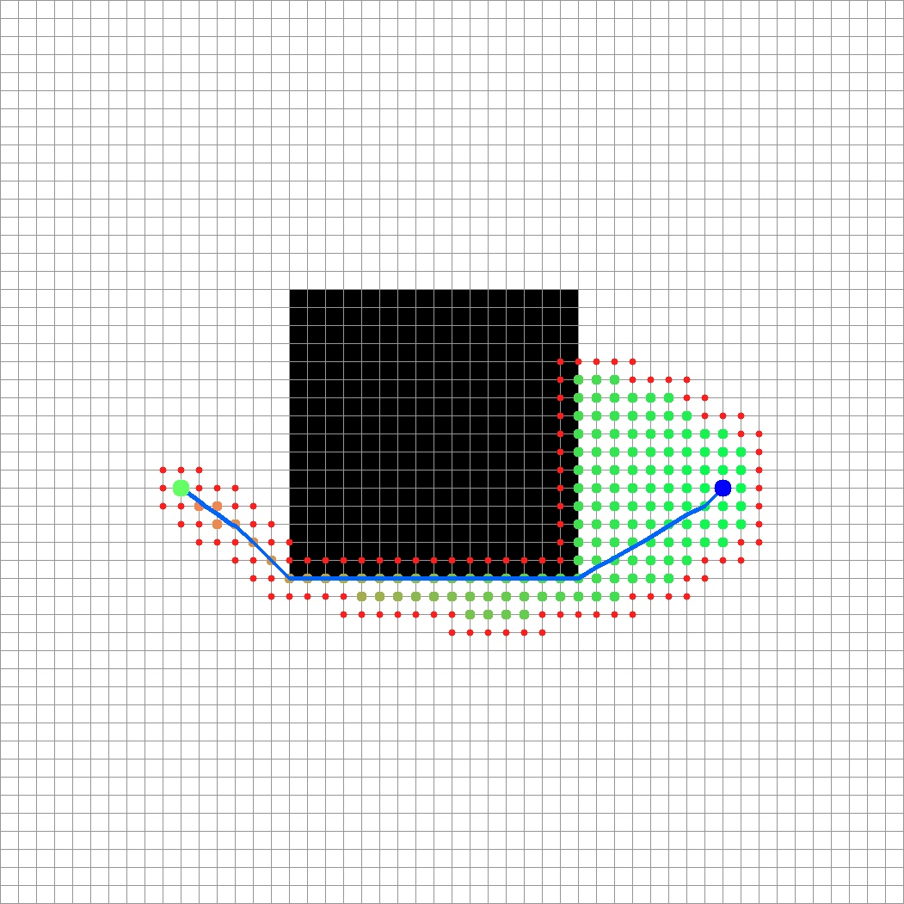
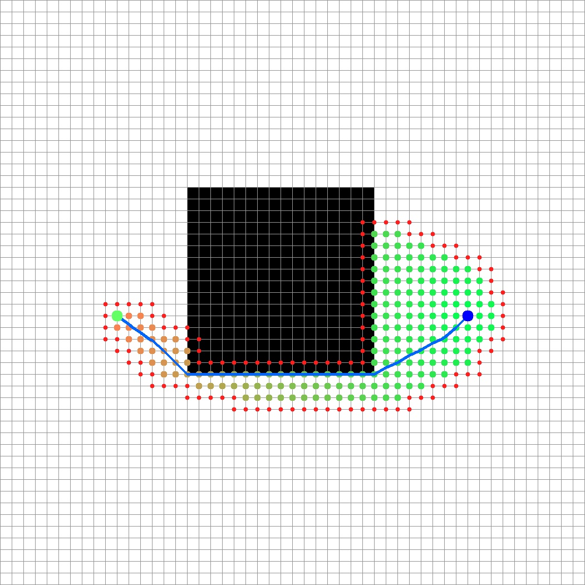
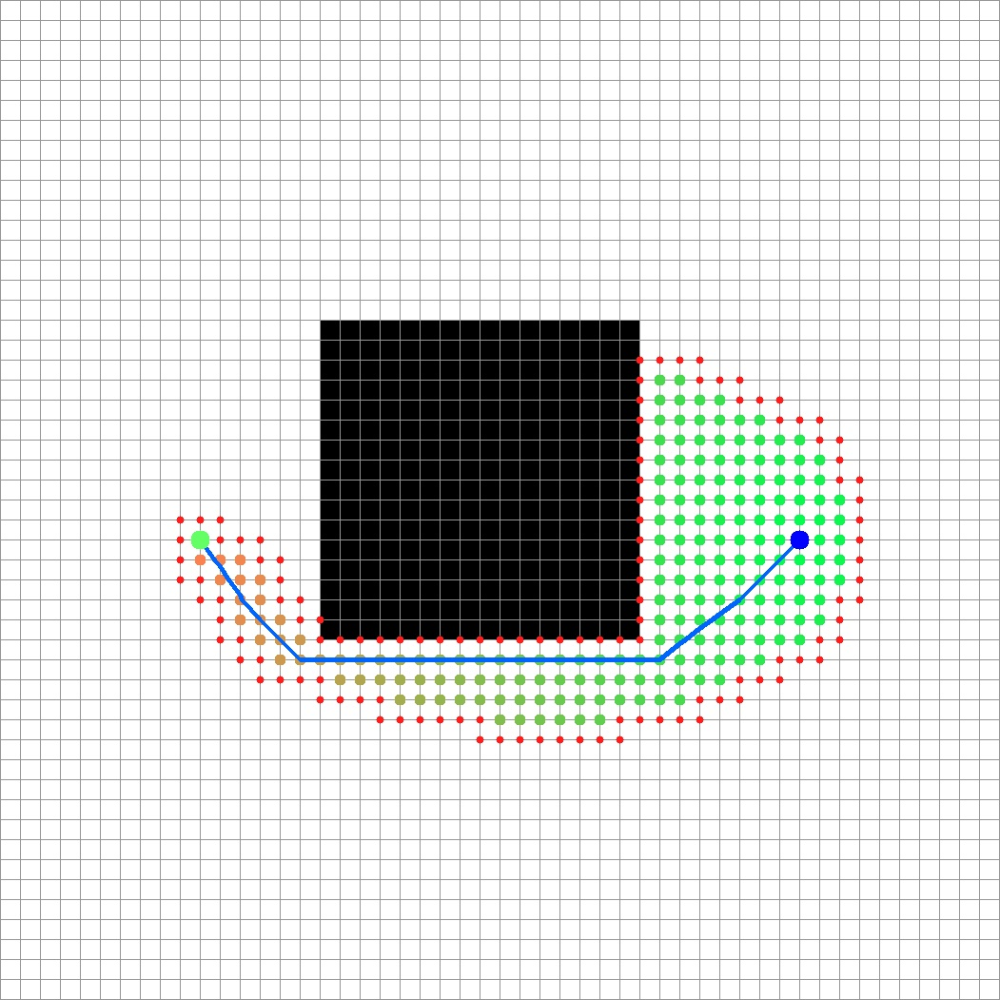
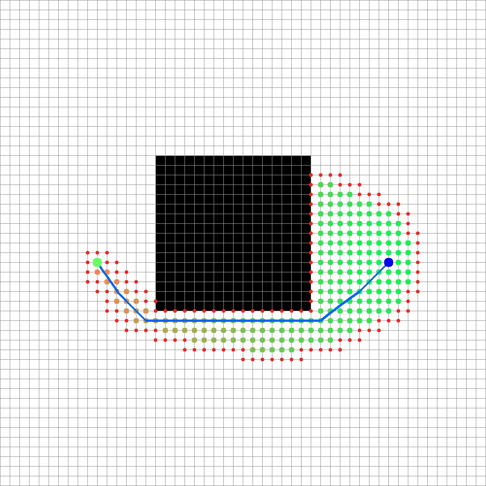

| Cells | Width | Height | Average cost | Minimum cost | Maximum cost |
| ----- | ----- | ------ | ------------ | ------------ | ------------ |
| 2500  | 50    | 50     | 1            | 1            | 1            |

| Lookahead | C-space | Optimization | Step time (ms) | Path length | Path cost |
| --------- | ------- | ------------ | -------------- | ----------- | --------- |
| 0         | 0       | 0            | 4.959          | 33.3168     | 33.3168   |
| 0         | 0       | 1            | 2.249          | 33.3168     | 33.3168   |
| 0         | 1       | 0            | 8.657          | 35.0784     | 35.0784   |
| 0         | 1       | 1            | 2.283          | 35.084      | 35.084    |
| 1         | 0       | 0            | 6.097          | 33.3168     | 33.3168   |
| 1         | 0       | 1            | 2.343          | 33.3168     | 33.3168   |
| 1         | 1       | 0            | 8.773          | 35.0784     | 35.0784   |
| 1         | 1       | 1            | 2.383          | 35.084      | 35.084    |

  # Lookahead OFF | C-space 0 | Basic D-Lite version
  
  # Lookahead OFF | C-space 0 | Initial optimized version
  
  # Lookahead OFF | C-space 1 | Basic D-Lite version
  
  # Lookahead OFF | C-space 1 | Initial optimized version
  
  # Lookahead ON | C-space 0 | Basic D-Lite version
  
  # Lookahead ON | C-space 0 | Initial optimized version
  
  # Lookahead ON | C-space 1 | Basic D-Lite version
  
  # Lookahead ON | C-space 1 | Initial optimized version
  

  
