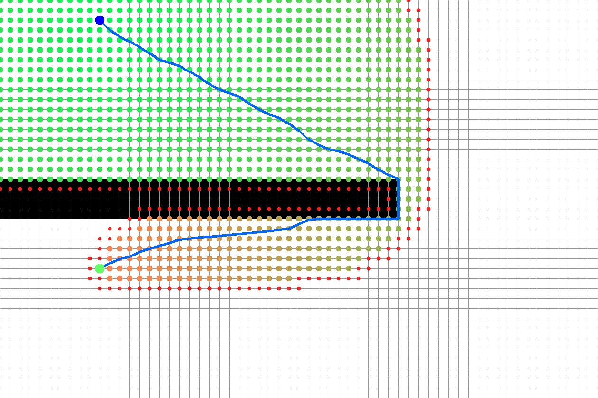
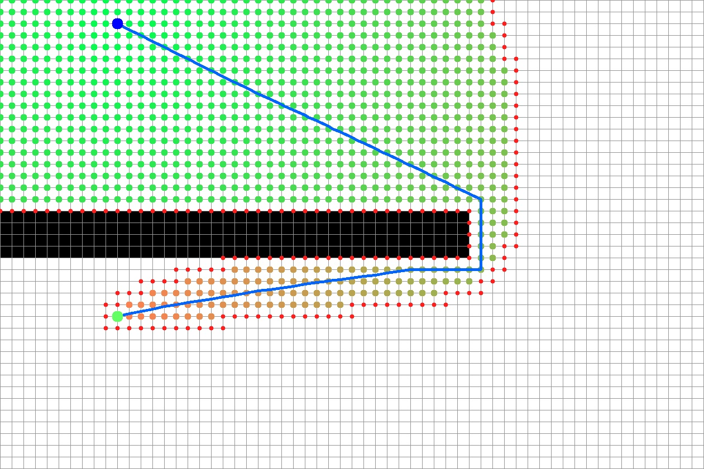
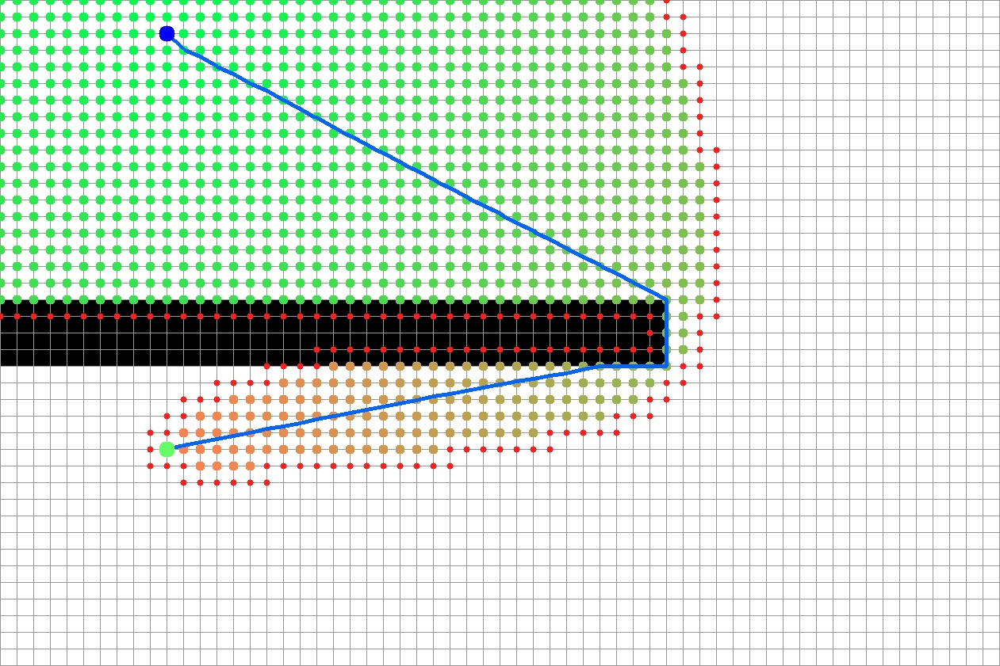
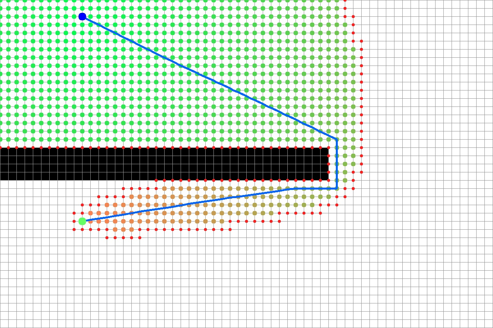

| Cells | Width | Height | Average cost | Minimum cost | Maximum cost |
| ----- | ----- | ------ | ------------ | ------------ | ------------ |
| 2400  | 60    | 40     | 1            | 1            | 1            |

| Lookahead | C-space | Optimization | Step time (ms) | Path length | Path cost |
| --------- | ------- | ------------ | -------------- | ----------- | --------- |
| 0         | 0       | 0            | 38.428         | 68.5403     | 68.5403   |
| 0         | 0       | 1            | 8.747          | 68.5649     | 68.5649   |
| 0         | 1       | 0            | 40.217         | 71.7568     | 71.7568   |
| 0         | 1       | 1            | 10.114         | 71.7679     | 71.7679   |
| 1         | 0       | 0            | 38.523         | 68.5403     | 68.5403   |
| 1         | 0       | 1            | 10.056         | 68.5649     | 68.5649   |
| 1         | 1       | 0            | 40.631         | 71.7568     | 71.7568   |
| 1         | 1       | 1            | 10.639         | 71.7679     | 71.7679   |

  # Lookahead OFF | C-space 0 | Basic D-Lite version
  
  # Lookahead OFF | C-space 0 | Initial optimized version
  
  # Lookahead OFF | C-space 1 | Basic D-Lite version
  
  # Lookahead OFF | C-space 1 | Initial optimized version
  
  # Lookahead ON | C-space 0 | Basic D-Lite version
  
  # Lookahead ON | C-space 0 | Initial optimized version
  
  # Lookahead ON | C-space 1 | Basic D-Lite version
  
  # Lookahead ON | C-space 1 | Initial optimized version
  

  
