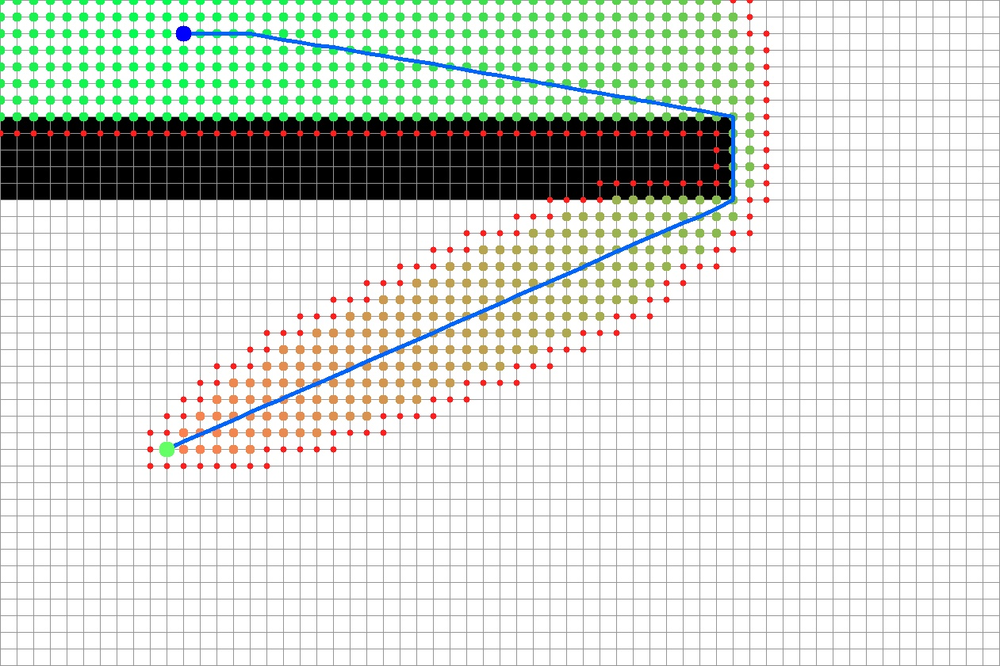
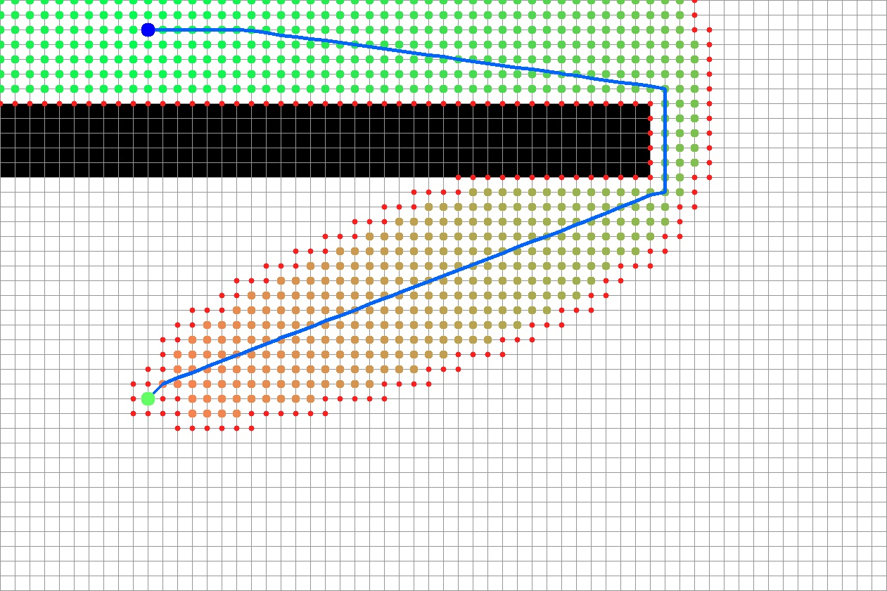
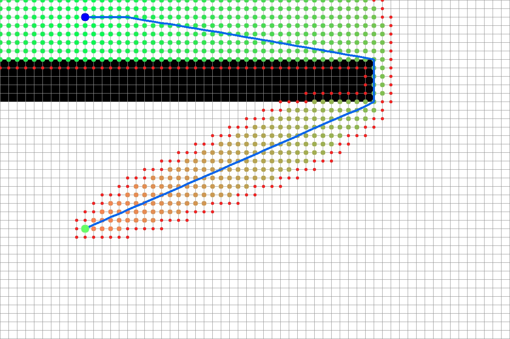
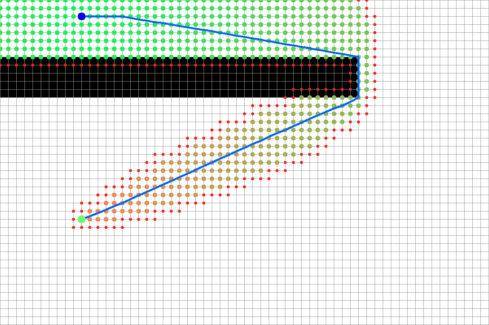
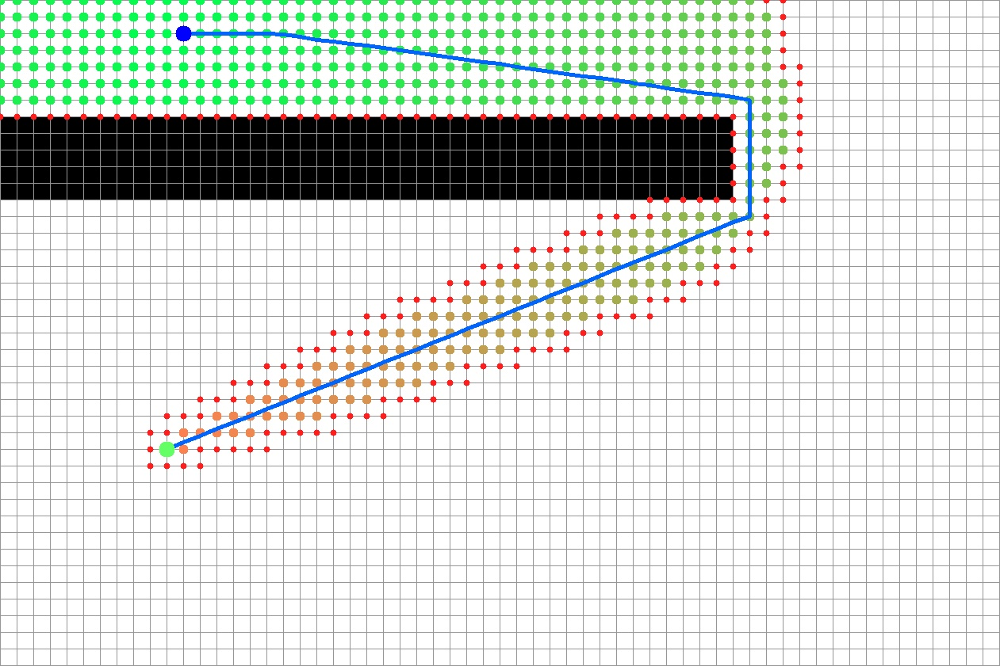
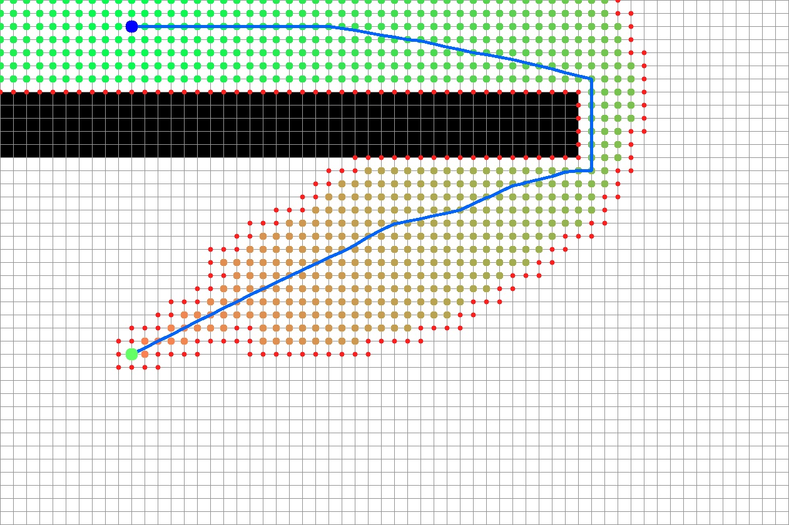

| Cells | Width | Height | Average cost | Minimum cost | Maximum cost |
| ----- | ----- | ------ | ------------ | ------------ | ------------ |
| 2400  | 60    | 40     | 1            | 1            | 1            |

| Lookahead | C-space | Optimization | Step time (ms) | Path length | Path cost |
| --------- | ------- | ------------ | -------------- | ----------- | --------- |
| 0         | 0       | 0            | 11             | 75.6023     | 76.2935   |
| 0         | 0       | 1            | 2              | 75.6131     | 76.3043   |
| 0         | 1       | 0            | 10             | 78.9845     | 79.9763   |
| 0         | 1       | 1            | 5              | 78.9898     | 79.9816   |
| 1         | 0       | 0            | 14             | 75.6023     | 76.2935   |
| 1         | 0       | 1            | 3              | 75.6131     | 76.3043   |
| 1         | 1       | 0            | 10             | 78.9845     | 79.9763   |
| 1         | 1       | 1            | 5              | 78.9898     | 79.9816   |

  # Lookahead OFF | C-space 0 | Basic D-Lite version
  
  # Lookahead OFF | C-space 0 | Initial optimized version
  
  # Lookahead OFF | C-space 1 | Basic D-Lite version
  
  # Lookahead OFF | C-space 1 | Initial optimized version
  
  # Lookahead ON | C-space 0 | Basic D-Lite version
  
  # Lookahead ON | C-space 0 | Initial optimized version
  
  # Lookahead ON | C-space 1 | Basic D-Lite version
  
  # Lookahead ON | C-space 1 | Initial optimized version
  

  
